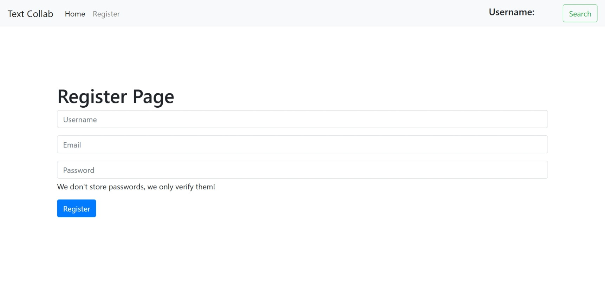

# Collab Text Editor Using Socket.io

ReactJs, NodeJs, MySQL(Prisma) and Express based full stack collaboration website
---------------------------------------------------------------------------------
Demo Video:

---------------------------------------------------------------------------------
Stack Used:

1. JWT tokens and Express Middleware to protect private routes                               
2. Prisma ORM with mysql2
3. bcrypt
4. Socket.io
5. uuid was used to create each document id
6. Used Context API to handle login state and username
7. react-router-dom for useNavigate and useParams and created private routes using BrowserRouter
8. cookies

------------------

1. Created a two user room using socket rooms
2. Used socket.emit to broadcast messages
3. useEffect was used to create listeners for incoming messages 

------------------
Scripts:

1. npm run dev (backend)
2. npm run dev (frontend)

---

Login and Register Page

|  |  |
| --------------------------------- | ---------------------------------- |

---

Different users have thier saved documents with unique uuid

|  |  |
| ---------------------------------- | ---------------------------------- |

---

Prima
